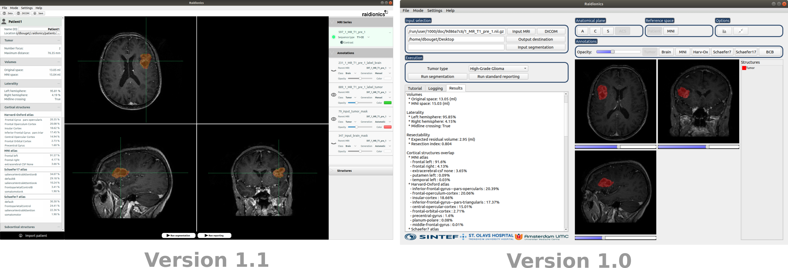

# Raidionics 
[](https://opensource.org/licenses/BSD-2-Clause)
[](https://github.com/dbouget/Raidionics/releases)


Software to automatically segment brain tumors from pre-operative MRI scans, compute their characteristics (e.g., volume, location), and generate a standardized report.
The software was introduced in the article "Brain tumor preoperative surgery imaging: models and software solutions for
segmentation and standardized reporting", which has been accepted in [Frontiers in Neurology](https://www.frontiersin.org/journals/neurology).  
Version 1.0 corresponds to the software as it was when the article was submitted, while version 1.1 is an improvement providing a more user-friendly graphical user interface.

* Please visit the [wiki](https://github.com/dbouget/Raidionics/wiki) to know more about usage, use-cases, and access tutorials.  
* For any issue, please report them [here](https://github.com/dbouget/Raidionics/issues).




## Installation
An installer is provided for the three main Operating Systems: Windows (~v10, 64-bit), macOS (>= Catalina), and Ubuntu Linux (>= 18.04). 
The software can be downloaded from [here](https://github.com/dbouget/Raidionics/releases) (see **Assets**). 

These steps are only needed to do once:
1) Download the installer to your Operating System.
2) Right click the downloaded file, click "open", and follow the instructions to install.
3) Search for the software "Raidionics" and double click to run.


## How to cite
If you are using Raidionics in your research, please use the following citation:
```
@misc{https://doi.org/10.48550/arxiv.2204.14199,
title = {Preoperative brain tumor imaging: models and software for segmentation and standardized reporting},
author = {Bouget, D. and Pedersen, A. and Jakola, A. S. and Kavouridis, V. and Emblem, K. E. and Eijgelaar, R. S. and Kommers, I. and Ardon, H. and Barkhof, F. and Bello, L. and Berger, M. S. and Nibali, M. C. and Furtner, J. and Hervey-Jumper, S. and Idema, A. J. S. and Kiesel, B. and Kloet, A. and Mandonnet, E. and Müller, D. M. J. and Robe, P. A. and Rossi, M. and Sciortino, T. and Brink, W. Van den and Wagemakers, M. and Widhalm, G. and Witte, M. G. and Zwinderman, A. H. and Hamer, P. C. De Witt and Solheim, O. and Reinertsen, I.},
doi = {10.48550/ARXIV.2204.14199},
url = {https://arxiv.org/abs/2204.14199},
keywords = {Image and Video Processing (eess.IV), Computer Vision and Pattern Recognition (cs.CV), Machine Learning (cs.LG), FOS: Electrical engineering, electronic engineering, information engineering, FOS: Electrical engineering, electronic engineering, information engineering, FOS: Computer and information sciences, FOS: Computer and information sciences, I.4.6; J.3},
publisher = {arXiv},
year = {2022},
copyright = {Creative Commons Attribution 4.0 International}}
```